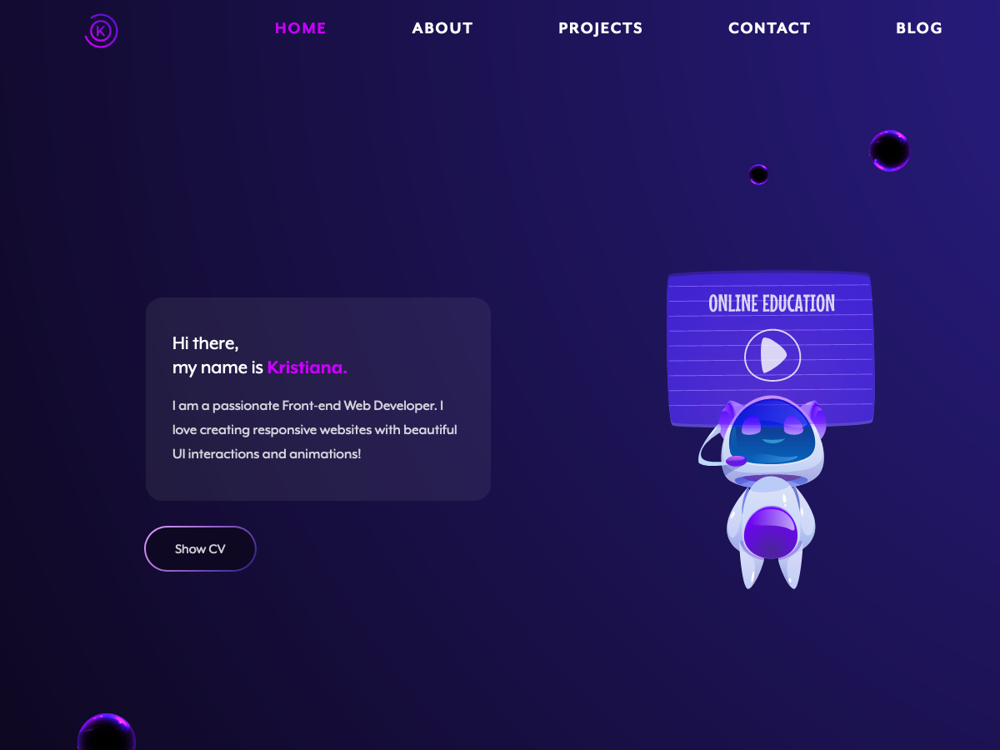

# My Portfolio

## Table of contents

- [Overview](#overview)
  - [Built with](#built-with)
  - [Screenshot](#screenshot)
- [My process](#my-process)
  - [What I learned](#what-i-learned)

    

## Overview

In order to create my portfolio, I created this custom Wordpress theme, using HTML, SASS, Javascript, PHP.

### Built with

 

 &nbsp;&nbsp;
&nbsp;&nbsp;
&nbsp;&nbsp;
 &nbsp;&nbsp;
 &nbsp;&nbsp;
 &nbsp;&nbsp;

(<a href="#readme-top">back to top</a>)

 

### Screenshot

 

(<a href="#readme-top">back to top</a>)

 

## My process

 

### What I learned

 

- Run Wordpress locally on Docker.
- How to create Wordpress custom themes.
- The Wordpress File and Directory Structure.
- Basics of PHP.
- Getting familiar with Wordpress functions and hooks.
- How to use the ACF Pro plugin to create and customize blocks.

